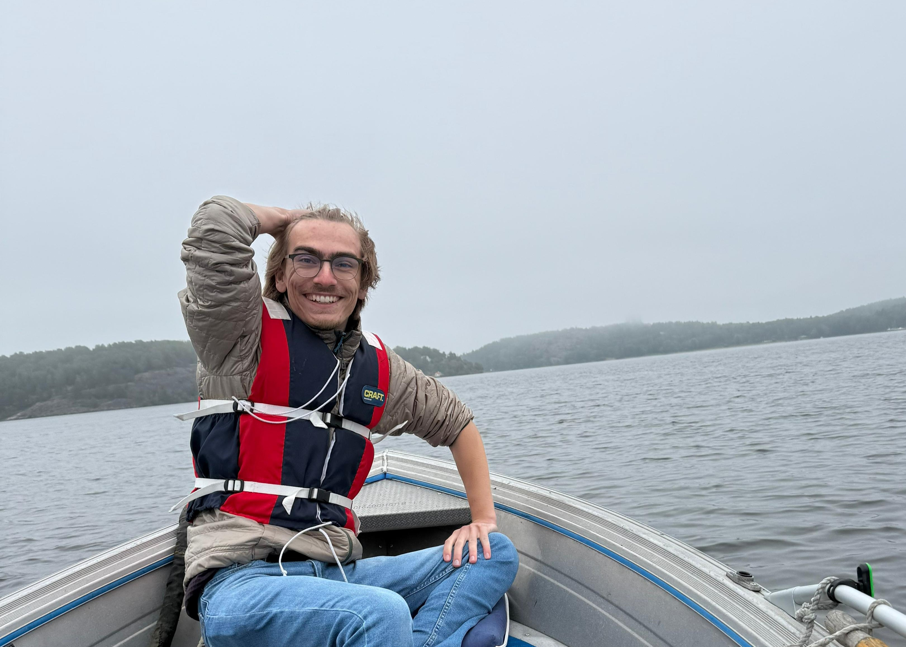

+++
date = '2026-03-23T10:04:01+01:00'
draft = true
title = ''

+++
<h1>
Hej hej! My name is William.
</h1>

<h3>Here is the about-me, lets-a-go. I have moved a lot, specifically in this order:</h3>
<h4>

1. Boca Raton, Florida, United States (Born 2002).
2. Stockholm, Sweden (Sister is born here!).
3. Tokyo, Japan.
4. San Jose, Costa Rica.
5. La Jolla, California, United States.
6. Oak Park, Illinois, United States.
7. Dubai, United Arab Emirates.
8. Frisco, Texas, United States.
9. Visby, Gotland, Sweden.
10. Stockholm, Sweden (I am here now!).

This had a big effect on me growing up being able to experience and interact with so many different cultures, but obviously moving was quite tough, especially moving away from friends. The solution: GAMES! Many friendships that I still have today were kept alive through gaming, whether it be playing Minecraft and TF2 while talking over Skype, playing Titanfall or Dying Light over Xbox Live, and nowadays playing... well mostly those same games, but over Discord! Even talking about games with others whenever I went to a new school was an incredibly effective way of breaking the ice and gaining new friends.

These experiences, being able to hold and start friendships via games, even if they are single-player games, are incredibly important to me, and is one of the reasons why I want to make games. So I wondered how one would go about making games, a large (and most interesting) portion of which was programming. 

So directly after High School in Texas I got accepted into the Game Design and Programming Bachelors att Uppsala University, so at 18 years old I made my first solo move back home to Sweden and lived in Visby for 3 years. After graduating I moved back to Stockholm and looked for a job, and while searching I realised that I needed to up-skill my programming skills, resulting in me being accepted to The Game Assembly!
</h4>

---

<h3>Enough about moving around! Here are some things I enjoy doing in my free time :
<h4>

- Playing Video Games! (Currently playing : Vintage Story).
  - Love games with oddly specific details, shows craftsmanship!
- Learning strange facts (Platypuses are venomous). 
- Watching lore videos about media that I'll most likely never watch/play.
- Listening to podcasts (mostly sci-fi audio dramas).
- Practicing voice acting (it's fun!).
- DM'ing for the TTRPG Mörk Borg.

Safe to say I enjoy learning things, a lot of inspiration that can be taken from the strangest of places! Quite often I realis
</h4>

</h3>

---

