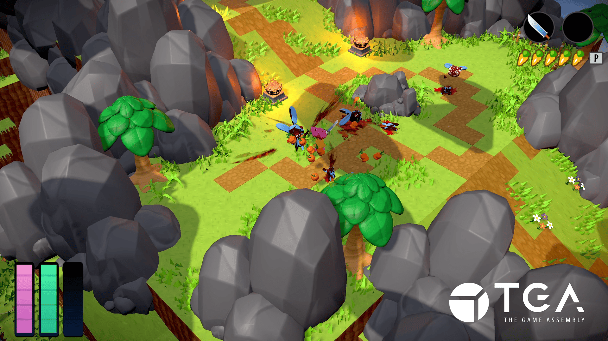
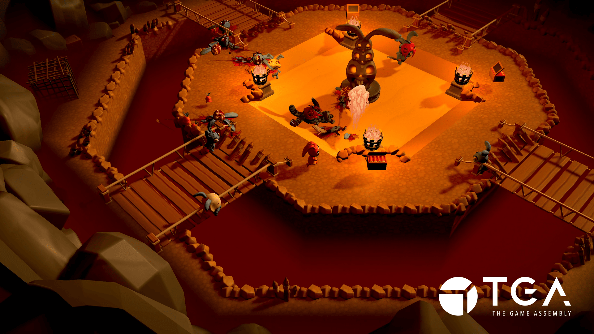

+++
date = '2025-03-23'
draft = false
title = 'Isometric Adventure : Cannibal Crossing'

summary = """Isometric adventure game, using the game "Tunic" as reference, with the artstyle of Animal Crossing and the brutality of Doom."""

tags = ["C++", "Custom Engine", "Group Project"]

+++

---

## Language: `C++`

## Contributions:
- **Player (Attack/Movement Controller, Animation Handling, Sound Implementation, etc.).**
- **Player Lock-On (Enemy Targeting Assist)**
- **Inventory System (Weapon Unlocks and Ammunition)**
- **Health/Stamina Component**
- **Controller Support**
- **Helped Implement UI and Menus**
- **Implemented Additional Animation Utility Functions**

## Tools:
- **Custom Engine (C++)**
- **Perforce P4 (HELIX CORE)**
- **Discord Game SDK**
- **YouTrack**
- **WWise**

---
## Time Frame: 10 weeks (~20 hours a week)

## Team Size: 14
- ***Programmers:*** 4
- ***Level Designers:*** 3
- ***Procedural Artists:*** 2
- ***Graphical Artists:*** 4
- ***Project Coordinator:*** 1
---

<h2>
"As a Bunny separated from your herd, explore the environments around you for weapons and look for a way back to your friends. Beware… everything is not as it seems, and you may have to battle more just your sense of direction to make it back in one piece” 
</h2>

  <iframe 
    src="https://www.youtube.com/embed/KYTREdqpD-Y?si=BUT2lUHV3v6nzobx"
    title="YouTube video player"
    frameborder="0"
    allow="accelerometer; autoplay; clipboard-write; encrypted-media; gyroscope; picture-in-picture; web-share"
    referrerpolicy="strict-origin-when-cross-origin"
    allowfullscreen
    style="position: absolute; top: 0; left: 0; width: 100%; height: 100%;">
  </iframe>

  
  

    <iframe frameborder="0" src="https://itch.io/embed/3633608?bg_color=ed78da&amp;fg_color=ffffff&amp;link_color=c40018&amp;border_color=08c4d0" width="552" height="167">
    <a href="https://ol-milk.itch.io/cannibal-crossing">Cannibal Crossing by Milk Man, Ronny.P, Xmandier</a>
    </iframe>

