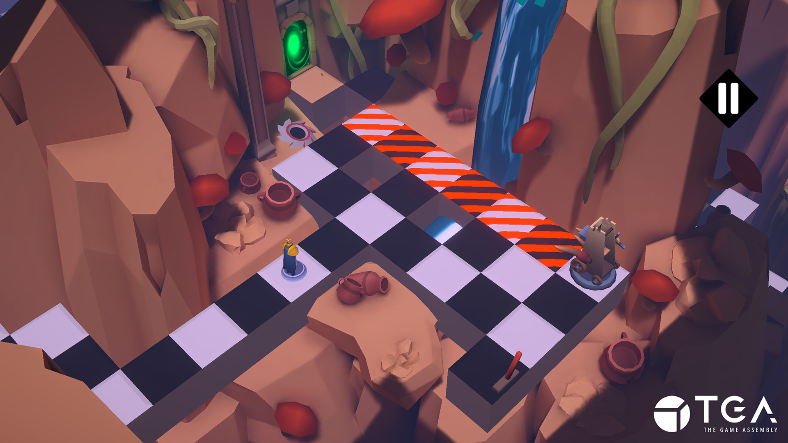
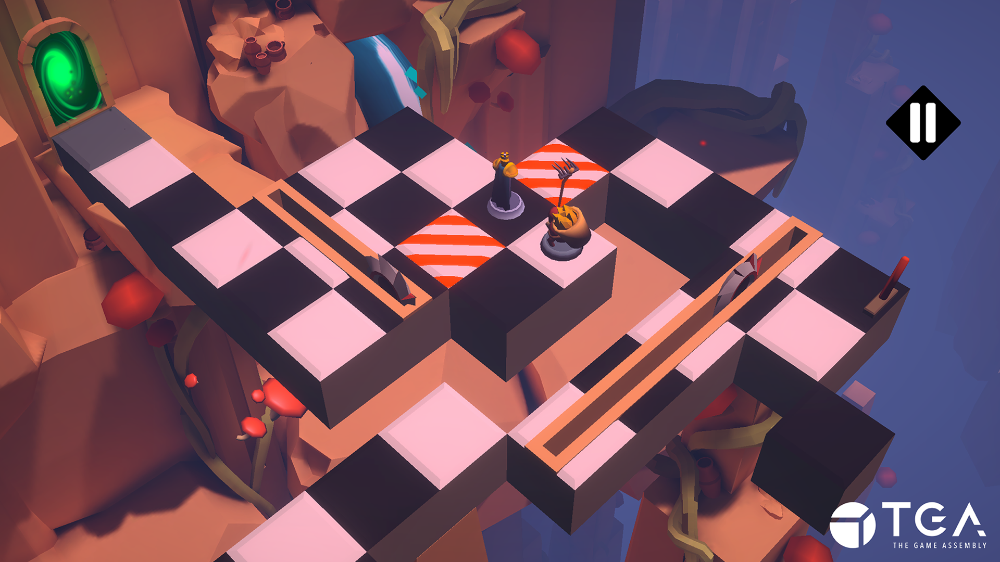

+++
date = '2025-03-15T10:19:22+01:00'
draft = true
title = 'Phone Puzzle Game : Checkmate'
tags = ["C#", "Unity", "Android" ,"Group Project"]

+++

  <iframe 
    src="https://www.youtube.com/embed/tmE0P2CMfgs?si=be1wuuDJgMC1Elhv"
    title="YouTube video player"
    frameborder="0"
    allow="accelerometer; autoplay; clipboard-write; encrypted-media; gyroscope; picture-in-picture; web-share"
    referrerpolicy="strict-origin-when-cross-origin"
    allowfullscreen
    style="position: absolute; top: 0; left: 0; width: 100%; height: 100%;">
  </iframe>

<h2>
"Your Kingdom was attacked by the Rubrum Empire.
heavily wounded, you barely manage to escape from the battle and are now unable to walk diagonally. you will have to navigate a treacherous path through ancient ruins while outsmarting the Rubrum army hot on your heels.  

Emerge on the other side to escape and have a chance at rebuilding your army to retake your home."
</h2>

---

## Language: `C#`

## Contributions:
- **Player Implementation**
- **Enemy Implementation**
- **Environmental Hazard Implementation**
- **Player vs. Enemy vs. Environment Interactions**
- **Dynamic Grid System (Anything Interactable/Moving Used This System)**
- **Moving/Destroyable Ground Tiles**

## Tools:
- **Unity**
- **Perforce P4 (HELIX CORE)**
- **YouTrack**

---

## Time Frame: 6 weeks (~20 hours a week)

## Team Size: 12
- ***Programmers:*** 4
- ***Level Designers:*** 2
- ***Procedural Artists:*** 2
- ***Graphical Artists:*** 3
- ***Additional Programmer:*** 1

---

  
  

