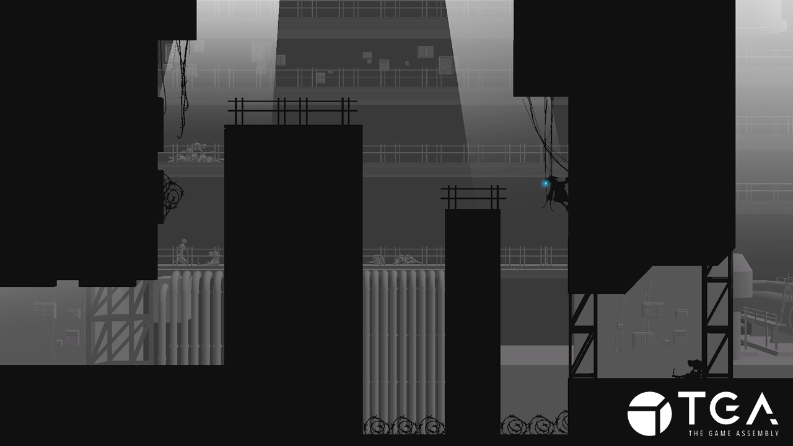
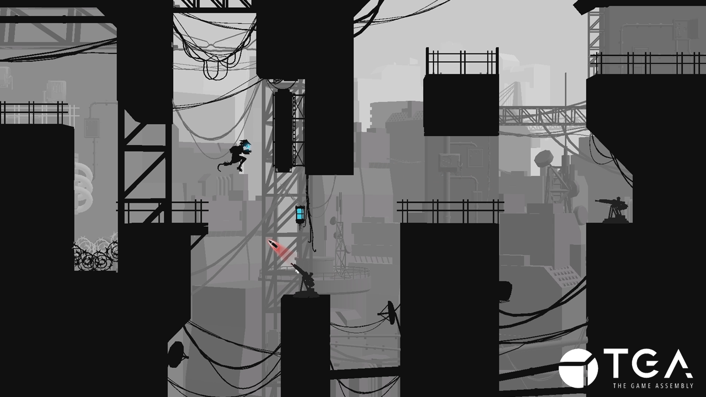

+++
date = '2025-03-21T10:19:22+01:00'
draft = true
title = 'Platformer : D4RK'
tags = ["C++", "Custom Engine", "Group Project"]

+++

  <iframe 
    src="https://www.youtube.com/embed/trmqL1PDcX4?si=EWEbLgp3D3U_4CCR"
    title="YouTube video player"
    frameborder="0"
    allow="accelerometer; autoplay; clipboard-write; encrypted-media; gyroscope; picture-in-picture; web-share"
    referrerpolicy="strict-origin-when-cross-origin"
    allowfullscreen
    style="position: absolute; top: 0; left: 0; width: 100%; height: 100%;">
  </iframe>

<h2>
"D4RK is a 2.5D black-and-white platformer where you, a cyborg samurai, navigate a desolate city ruled by alien machines. The focus is on exploration, survival, and atmospheric storytelling."
</h2>

---

## Language: `C++`

## Contributions:
- **Camera Handling.**
- **Player (Movement Controller, Animation Handling, Respawn/Checkpoints, etc.).**
- **Level/Scene Loading and Manager (using [nholmann/json](https://github.com/nlohmann/json)).**
- **Controller Support for Input Mapper, UI, Player, etc.**
- **Assisted with UI Implementation.**
- **Environmental Objects (Moving Boxes, Kill Box's, Level Triggers).**

## Tools:
- **Custom Engine (C++)**
- **[nholmann/json](https://github.com/nlohmann/json)**
- **Perforce P4 (HELIX CORE)**
- **YouTrack**

---
## Time Frame: 11 weeks (~20 hours a week)

## Team Size: 16
- ***Programmers:*** 5
- ***Level Designers:*** 2
- ***Procedural Artists:*** 2
- ***Graphical Artists:*** 3
- ***Audio Production:*** 4

---

  <iframe frameborder="0" src="https://itch.io/embed/3478970?bg_color=000000&amp;fg_color=ffffff&amp;link_color=ffffff&amp;border_color=cccccc" width="1104" height="167">
    <a href="https://ol-milk.itch.io/d4rk">D4RK by Milk Man, Jacob vB, Weaf99, sonyanils, Embh, Moose-D2, Sadouren</a>
  </iframe>

  
  

