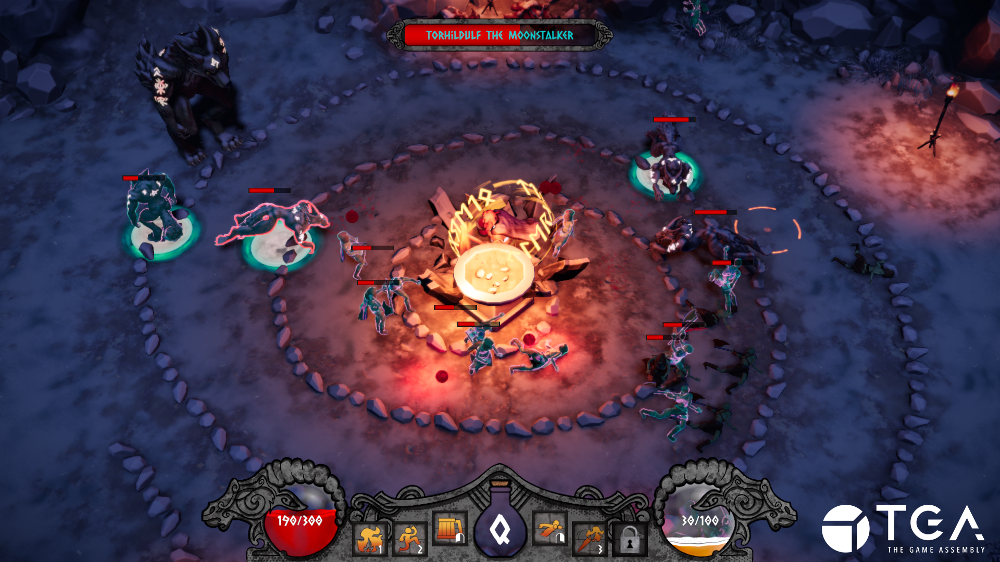
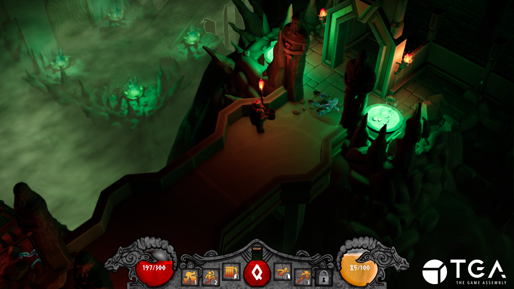

+++
date = '2026-03-15'
draft = true
title = 'RTS : Spiteful Hangover'

tags = ["C++", "Custom Engine", "Group Project"]

+++

  <iframe 
    src="https://www.youtube.com/embed/MAAoL-r_vo4?si=-FXgv2KwoGHqf0PM"
    title="YouTube video player"
    frameborder="0"
    allow="accelerometer; autoplay; clipboard-write; encrypted-media; gyroscope; picture-in-picture; web-share"
    referrerpolicy="strict-origin-when-cross-origin"
    allowfullscreen
    style="position: absolute; top: 0; left: 0; width: 100%; height: 100%;">
  </iframe>

<h2>
"You wake up with a brutal hangover, angry that the spiteful undead have ruined your village. Drink, fight, and brawl your way through Viking madness to crush the dark force ruining your buzz."
</h2>

---

## Language: `C++`

## Contributions:
- **Player (Attack/Movement Controller, Animation Handling, Sound Implementation, Player Abilities, etc.).**
- **Ability Unlocks.**
- **UI Manager.**
- **Assisted in UI Implementation.**
- **Damage/Health Component.**
- **Health Pickups.**
- **Animation Utility Functions.**
- **Implemented Player Data Preservation/Set Between Level Switching.**
- **Voice Acted for Villager NPC.**

## Tools:
- **Custom Engine (C++)**
- **Perforce P4 (HELIX CORE)**
- **Discord Game SDK**
- **YouTrack**
- **FMOD**

---
## Time Frame: 13 weeks (~20 hours a week)

## Team Size: 17
- ***Programmers:*** 6
- ***Level Designers:*** 3
- ***Procedural Artists:*** 2
- ***Graphical Artists:*** 2
- ***Audio Production:*** 4

---

<iframe frameborder="0" src="https://itch.io/embed/4266346?bg_color=0f1318&amp;fg_color=e8e8e8&amp;link_color=fadd5b&amp;border_color=333333" width="1104" height="167">
<a href="https://ol-milk.itch.io/spiteful-hangover">Spiteful Hangover by Milk Man, gittne, Ilse Hermans, European_Robin, Dunnde, Xmandier, Duckie, Jacob vB, Embh</a>
</iframe>

  
  

